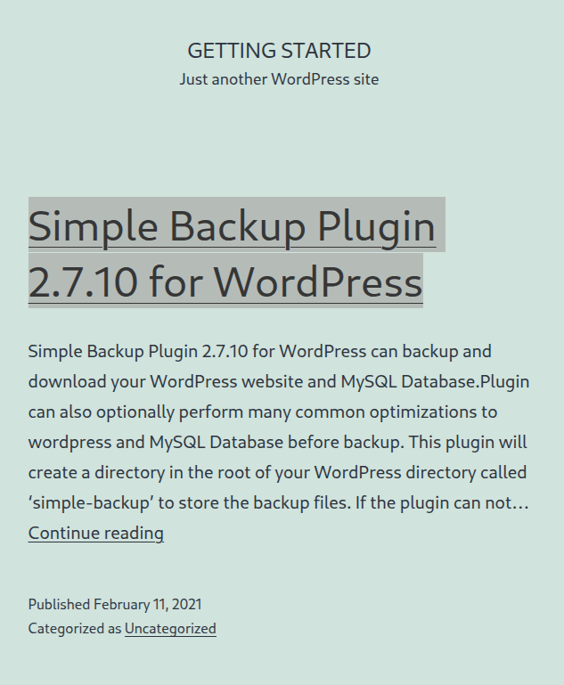
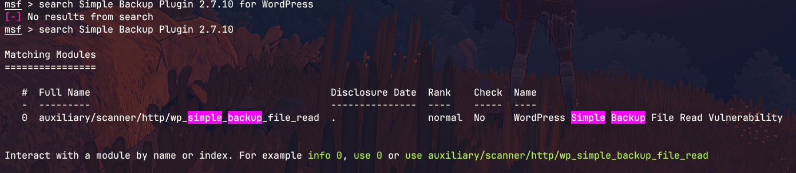
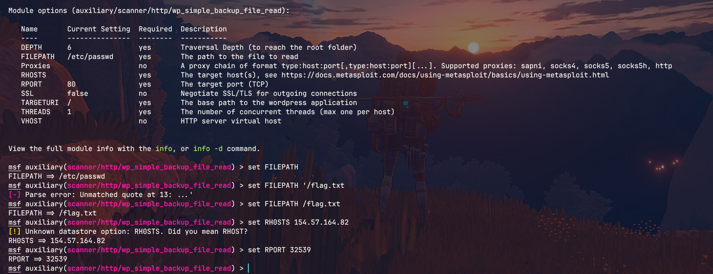
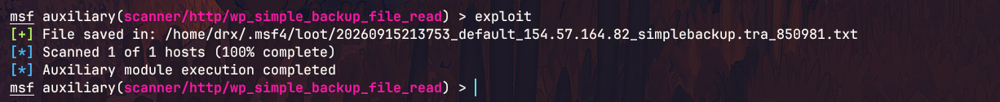

# Public Exploits HTB

# **Path:** CPTS — Getting Started

## Target `154.57.164.82:32539`

I started by accessing the target web application:

`http://154.57.164.82:32539/`



The target web application was using the Simple Backup Plugin Version 2.7.10

## Searching for an Exploit

I started **Metasploit** and searched for exploits related to the Simple Backup Plugin 2.7.10 .

The search returned a module that could be used to exploit the vulnerable plugin.



## Exploit Configuration

I selected the appropriate module and configured the required options for the target.



## Exploitation

After configuring the exploit, I executed it against the target.

The exploit was successful and provided access to the target system. I then located the file containing the flag.



## Flag

The flag was successfully retrieved from the target.

`HTB{my_f1r57_h4ck}`


## Conclusion

This lab demonstrated how to use **Metasploit** to exploit a vulnerable plugin.

The process was:

```text
Target Web Application
    ↓
Simple Backup Plugin 2.7.10
    ↓
Search for a Plugin exploit
    ↓
Metasploit module
    ↓
Configure the module
    ↓
Exploit
    ↓
Retrieve the flag